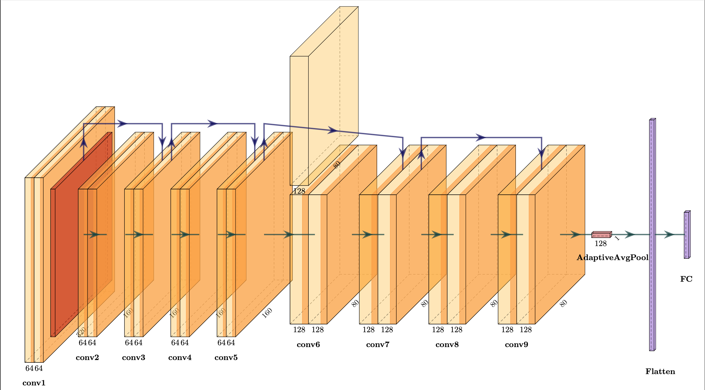

# Markdown教程

# 1 Markdown 标题


Markdown 标题有两种格式。

### 使用 = 和 - 标记一级和二级标题

= 和 - 标记语法格式如下：

```
我展示的是一级标题
=================

我展示的是二级标题
-----------------
```

### 使用 # 号标记

使用 **#** 号可表示 1-6 级标题，一级标题对应一个 **#** 号，二级标题对应两个 **#** 号，以此类推。

```
# 一级标题
## 二级标题
### 三级标题
#### 四级标题
##### 五级标题
###### 六级标题
```

最多六个标题 效果图如下

# 一级标题
## 二级标题
### 三级标题
#### 四级标题
##### 五级标题

###### 六级标题


# 2 Markdown 字体形式

Markdown 可以使用以下几种字体：

```
*斜体文本*
_斜体文本_
**粗体文本**
__粗体文本__
***粗斜体文本***
___粗斜体文本___
```

*斜体文本*
_斜体文本_
**粗体文本**
__粗体文本__
***粗斜体文本***
___粗斜体文本___


## 分隔线

你可以在一行中用三个以上的星号、减号、底线来建立一个分隔线，行内不能有其他东西。你也可以在星号或是减号中间插入空格。下面每种写法都可以建立分隔线：

```
***

* * *

*****

- - -

----------
```


***

* * *

*****

- - -

----------

## 删除线

如果段落上的文字要添加删除线，只需要在文字的两端加上两个波浪线 **~~** 即可，实例如下：

```
RUNOOB.COM
GOOGLE.COM
~~BAIDU.COM~~
```


RUNOOB.COM
GOOGLE.COM
~~BAIDU.COM~~

## 下划线

下划线可以通过 HTML 的 **<u>** 标签来实现：

```
<u>带下划线文本</u>
```

<u>带下划线文本</u>

## 脚注

脚注是对文本的补充说明。

Markdown 脚注的格式如下:

```
[^要注明的文本]
```

```
创建脚注格式类似这样 [^RUNOOB]。

[^RUNOOB]: 菜鸟教程 -- 学的不仅是技术，更是梦想！！！
```

创建脚注格式类似这样 [^RUNOOB]。

[^RUNOOB]: 菜鸟教程 -- 学的不仅是技术，更是梦想！！！


## 标签凸块

``` 
英文输入法下 ``
`饭饭`
```

`饭饭`

# 3 Markdown 区块

Markdown 区块引用是在段落开头使用 **>** 符号 ，然后后面紧跟一个**空格**符号：

```
> 饭饭
> 减减爱吃饭
> 减减好邪恶😈
```

> 饭饭
> 减减爱吃饭
> 减减好邪恶😈

另外区块是可以嵌套的，一个 **>** 符号是最外层，两个 **>** 符号是第一层嵌套，以此类推：

```
> 最外层
> > 第一层嵌套
> > > 第二层嵌套
```

> 最外层
> > 第一层嵌套
> >
> > > 第二层嵌套

### 区块中使用列表

区块中使用列表实例如下： 

```
> 区块中使用列表
> 1. 第一项
> 2. 第二项
> + 第一项
> + 第二项
> + 第三项
```

> 区块中使用列表
> 1. 第一项
> 2. 第二项
> + 第一项
> + 第二项
> + 第三项


### 列表中使用区块

如果要在列表项目内放进区块，那么就需要在 **>** 前添加四个空格的缩进。

列表中使用区块实例如下：

```
* 第一项
    > 菜鸟教程
    > 学的不仅是技术更是梦想
* 第二项
```

* 第一项
    > 菜鸟教程
    > 学的不仅是技术更是梦想
* 第二项


# 4 Markdown 代码

如果是段落上的一个函数或片段的代码可以用反引号把它包起来（**`**），例如：

```
`printf()` 函数
```

`printf()` 函数

### 代码区块

代码区块使用 **4 个空格**或者一个**制表符（Tab 键）**。

你也可以用 **```** 空格后包裹一段代码，并指定一种语言（也可以不指定）：

````
``` python
import troch
from torch.nn import nn
```
````

``` python
import troch
from torch.nn import nn
```

# 5 Markdown 链接

链接使用方法如下：

```
[链接名称](链接地址)

或者

<链接地址>
```

```
这是一个[B站链接](https://space.bilibili.com/313576911)
```

这是一个[B站链接](https://space.bilibili.com/313576911)

直接使用链接地址：

```
<https://space.bilibili.com/313576911>
```

<https://space.bilibili.com/313576911>

## 链接到本地

[图片](./1.png)

### 高级链接

我们可以通过变量来设置一个链接，变量赋值在文档末尾进行：

```
这个链接用 1 作为网址变量 [Google][1]
这个链接用 runoob 作为网址变量 [Runoob][runoob]
然后在文档的结尾为变量赋值（网址）

  [1]: http://www.google.com/
  [runoob]: http://www.runoob.com/
```

这个链接用 1 作为网址变量 [Google][1]
这个链接用 runoob 作为网址变量 [Runoob][runoob]
然后在文档的结尾为变量赋值（网址）

[1]: http://www.google.com/
[runoob]: http://www.runoob.com/


# 6 Markdown 图片

Markdown 图片语法格式如下：

```


```

- 开头一个感叹号 !
- 接着一个方括号，里面放上图片的替代文字
- 接着一个普通括号，里面放上图片的网址，最后还可以用引号包住并加上选择性的 'title' 属性的文字。

使用实例：

```



```


Markdown 还没有办法指定图片的高度与宽度，如果你需要的话，你可以使用普通的 ` `标签。

```

```


# 7 Markdown 表格

Markdown 制作表格使用 **|** 来分隔不同的单元格，使用 **-** 来分隔表头和其他行。

语法格式如下：

```
|  表头   | 表头  |
|  ----  | ----  |
| 单元格  | 单元格 |
| 单元格  | 单元格 |
```


对齐方式

**我们可以设置表格的对齐方式：**

- **-:** 设置内容和标题栏居右对齐。
- **:-** 设置内容和标题栏居左对齐。
- **:-:** 设置内容和标题栏居中对齐。

实例如下：

```
| 左对齐 | 右对齐 | 居中对齐 |
| :-----| ----: | :----: |
| 单元格 | 单元格 | 单元格 |
| 单元格 | 单元格 | 单元格 |
```

| 左对齐 | 右对齐 | 居中对齐 |
| :----- | -----: | :------: |
| 单元格 | 单元格 |  单元格  |
| 单元格 | 单元格 |  单元格  |


# 8 Markdown 高级技巧


### 支持的 HTML 元素

不在 Markdown 涵盖范围之内的标签，都可以直接在文档里面用 HTML 撰写。

目前支持的 HTML 元素有：`<kbd> <b> <i> <em> <sup> <sub> <br>`等 ，如：

```
使用 <kbd>Ctrl</kbd>+<kbd>Alt</kbd>+<kbd>Del</kbd> 重启电脑
```

使用 <kbd>Ctrl</kbd>+<kbd>Alt</kbd>+<kbd>Del</kbd> 重启电脑

### 转义

Markdown 使用了很多特殊符号来表示特定的意义，如果需要显示特定的符号则需要使用转义字符，Markdown 使用反斜杠转义特殊字符：

```
**文本加粗** 
\*\* 正常显示星号 \*\*
```

**文本加粗** 
\*\* 正常显示星号 \*\*


### 公式

当你需要在编辑器中插入数学公式时，可以使用两个美元符 $$ 包裹 TeX 或 LaTeX 格式的数学公式来实现。提交后，问答和文章页会根据需要加载 Mathjax 对数学公式进行渲染。如：

```
$$
\mathbf{V}_1 \times \mathbf{V}_2 =  \begin{vmatrix} 
\mathbf{i} & \mathbf{j} & \mathbf{k} \\
\frac{\partial X}{\partial u} &  \frac{\partial Y}{\partial u} & 0 \\
\frac{\partial X}{\partial v} &  \frac{\partial Y}{\partial v} & 0 \\
\end{vmatrix}
${$tep1}{\style{visibility:hidden}{(x+1)(x+1)}}
$$
```

$$
\mathbf{V}_1 \times \mathbf{V}_2 =  \begin{vmatrix} 
\mathbf{i} & \mathbf{j} & \mathbf{k} \\
\frac{\partial X}{\partial u} &  \frac{\partial Y}{\partial u} & 0 \\
\frac{\partial X}{\partial v} &  \frac{\partial Y}{\partial v} & 0 \\
\end{vmatrix}
${$tep1}{\style{visibility:hidden}{(x+1)(x+1)}}
$$

### 公式实时编译

为了触发行内内嵌数学符号的实时编译你需要：输入$然后按下ESC键之后输入TeX命令，之后就会弹出一个如图所示的工具提示栏

$\tau = a +b$

### 下标

想要使用这个功能，需要在设置面板的 Markdown 栏启动它，之后使用~来修饰下标文本。栗如：

```
H~2~O 和X~long\ text~
```


H~2~O 和X~long\ text~

### 上标

想要使用这个功能，需要在设置面板的 Markdown 栏启动它，之后使用^来修饰下标文本。栗如：

```
X^2^ 
```


X^2^ 

## 代办列表

代办列表 语法：减号加空格加 [ 加空格 ]空格加文字

```
- [ ] 减减
- [ ] 饭饭
- [ ] 减减好邪恶😈
- [x] 减减好邪恶😈
```


- [ ] 减减
- [ ] 饭饭
- [ ] 减减好邪恶😈
- [x] 减减好邪恶😈
